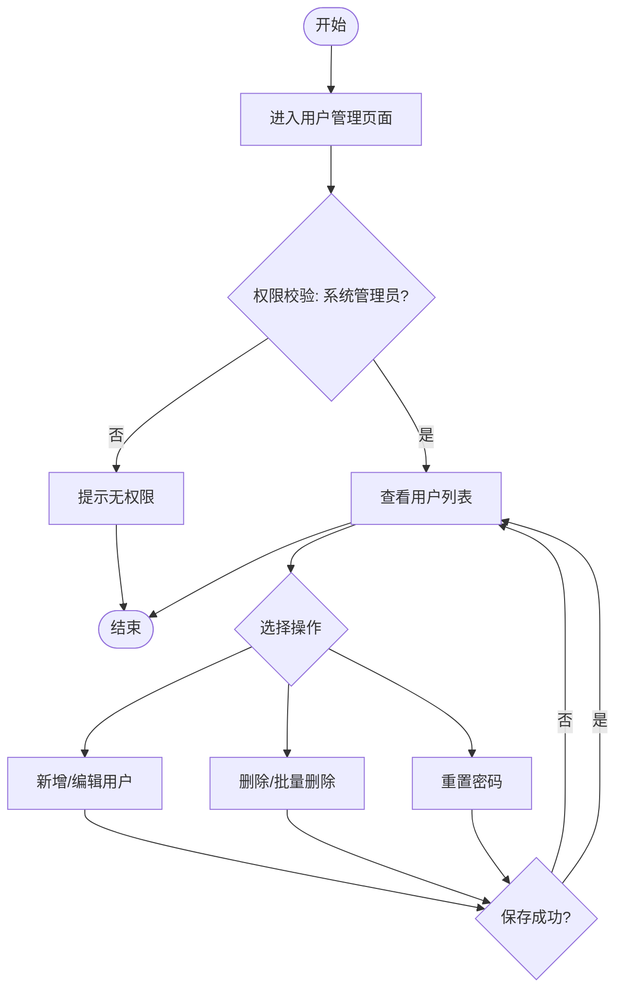
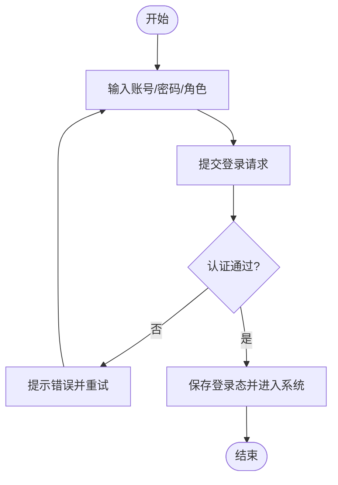
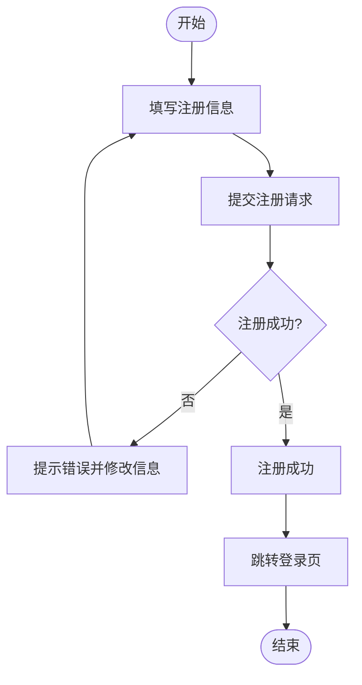
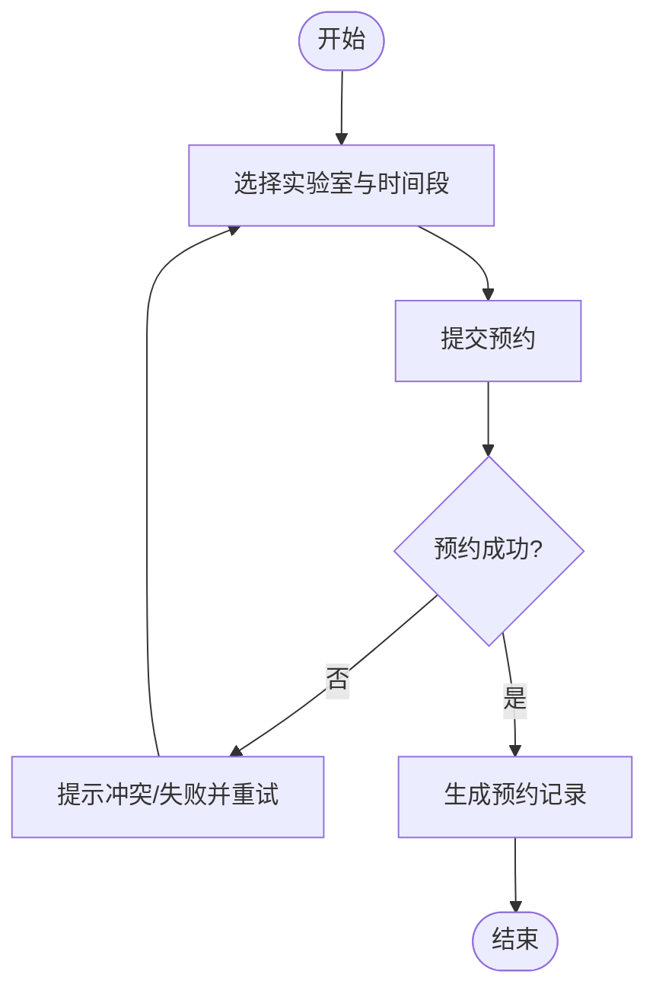
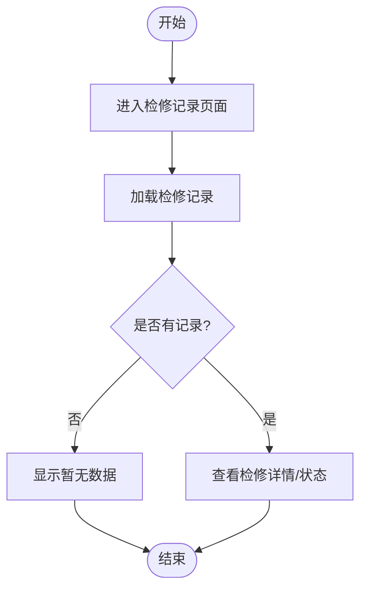
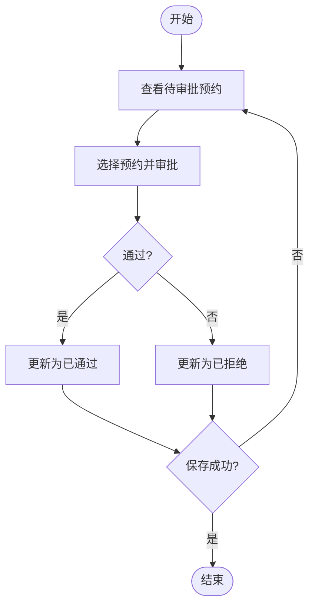
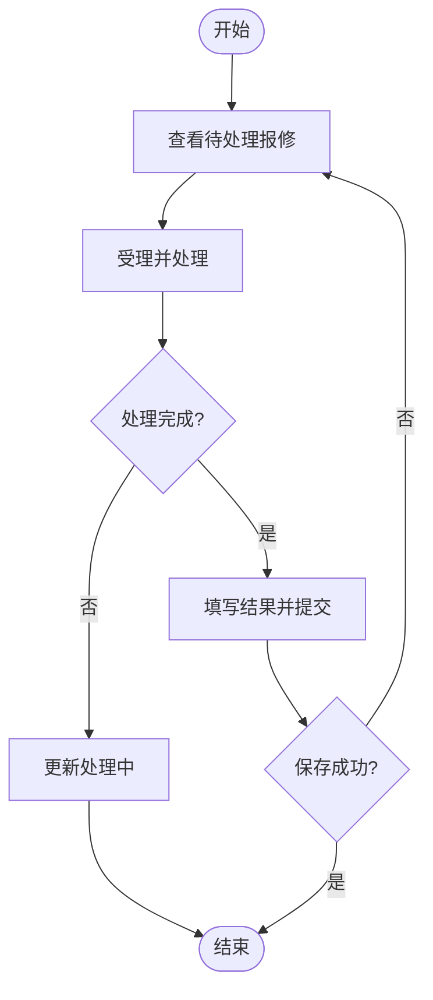
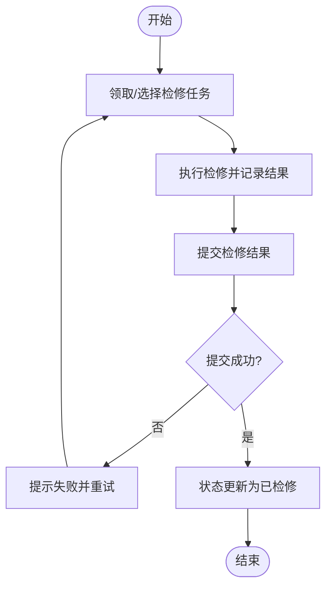
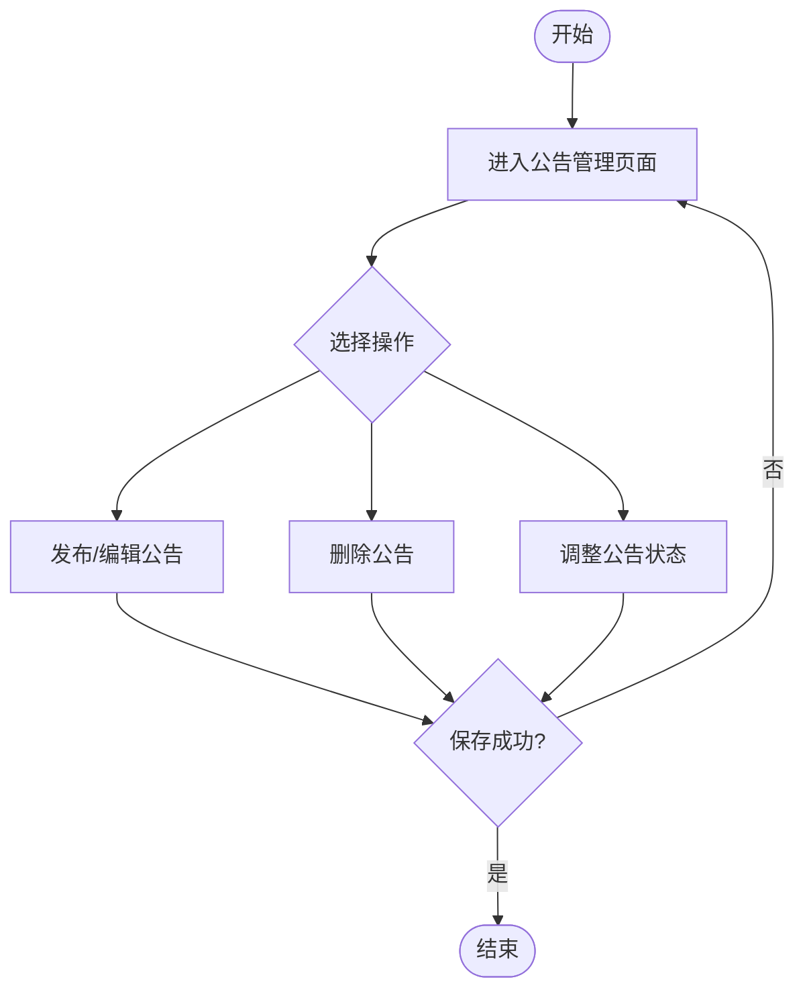
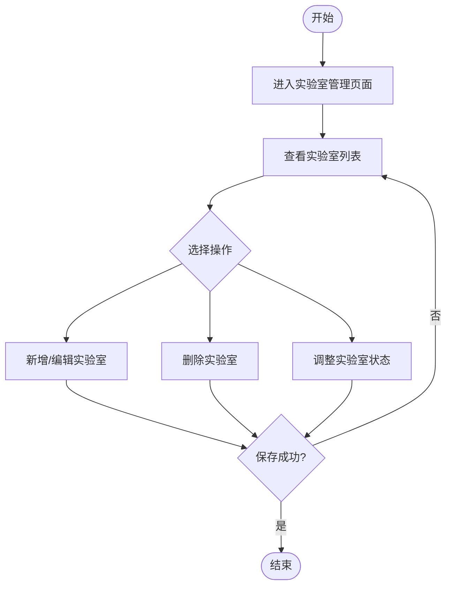

# 4. 业务功能流程图

以下流程图基于系统现有业务模块整理，均包含开始、关键判断与结束流程。

## 图4-1 用户管理功能模块流程图

功能介绍：用户管理模块面向系统管理员，提供用户信息的统一维护能力，包括用户查询、新增、编辑、删除、批量删除以及密码重置。模块同时内置角色约束机制：系统管理员角色不可被修改，普通角色仅可在实验室管理员、老师、学生之间调整，确保权限边界清晰、数据安全可控。



图4-1 用户管理功能模块流程图

## 图4-2 用户登录功能模块流程图

功能介绍：用户登录模块用于完成系统身份认证。用户输入账号、密码与角色后，系统校验账号有效性、密码正确性及角色匹配关系；认证通过后写入登录态并跳转首页，认证失败则反馈错误信息并允许重新输入，从而保障系统访问的安全性与准确性。



图4-2 用户登录功能模块流程图

## 图4-3 用户注册功能模块流程图

功能介绍：用户注册模块用于新用户创建账号。模块对必填项、密码一致性、角色合法性进行前置校验，并限制“系统管理员”不可自助注册；通过后调用注册接口完成账号创建。该模块降低了普通用户入门成本，同时避免高权限账号被滥用注册。



图4-3 用户注册功能模块流程图

## 图4-4 实验室预约功能模块流程图

功能介绍：实验室预约模块面向老师与学生，支持按实验室与时间段提交预约申请。系统会结合实验室状态、时间冲突等规则进行校验，合法后生成预约记录并进入后续审批或使用流程。该模块是实验室资源调度的核心入口。



图4-4 实验室预约功能模块流程图

## 图4-5 实验室报修功能模块流程图

功能介绍：实验室报修模块用于对已使用或符合条件的预约记录发起故障上报。用户填写报修内容后系统生成待处理工单，供管理员或实验室管理员后续处理。模块实现了从“问题发现”到“任务流转”的闭环起点。

```mermaid
flowchart TD
    A([开始]) --> B[进入报修功能页面]
    B --> C[选择一条预约记录作为报修对象]
    C --> D{是否满足报修条件?}
    D -- 否 --> E[提示不可报修原因] --> Z([结束])
    D -- 是 --> F[填写报修内容并提交]
    F --> G{提交成功?}
    G -- 否 --> H[提示失败并重试] --> F
    G -- 是 --> I[生成报修工单(待处理)]
    I --> Z([结束])
```

图4-5 实验室报修功能模块流程图

## 图4-6 实验室检修功能模块流程图

功能介绍：实验室检修模块用于查看检修任务的处理状态与结果信息。不同角色可按权限范围查看对应检修记录，包括处理人、处理时间、处理结论等内容，便于追踪故障处理进度并核验维修结果。



图4-6 实验室检修功能模块流程图

## 图4-7 审批预约功能模块流程图

功能介绍：审批预约模块面向系统管理员与实验室管理员，用于对待审批预约申请进行审核。管理者可执行通过或拒绝操作，并在拒绝时记录原因；系统随后更新预约状态并刷新待办列表，保证预约流程透明、可追溯。



图4-7 审批预约功能模块流程图

## 图4-8 处理报修功能模块流程图

功能介绍：处理报修模块用于管理员对报修工单进行受理、处理中、完成或驳回等状态流转管理。处理过程中可填写处理意见与结果信息，系统保存后同步更新工单状态，实现故障处理全生命周期管理。



图4-8 处理报修功能模块流程图

## 图4-9 处理检修功能模块流程图

功能介绍：处理检修模块面向检修执行人员与管理人员，用于领取检修任务、记录检修过程并提交检修结果。模块支持处理中进度更新与完成提交，确保检修工作有据可查、结果可复核。



图4-9 处理检修功能模块流程图

## 图4-10 公告管理功能模块流程图

功能介绍：公告管理模块由系统管理员使用，提供公告发布、编辑、删除与状态调整（如上下架）功能。通过该模块可统一维护系统通知信息，保障公告内容及时、准确地传达给各类用户。



图4-10 公告管理功能模块流程图

## 图4-11 实验室管理功能模块流程图

功能介绍：实验室管理模块用于维护实验室基础资料与运行状态，包括实验室新增、编辑、删除及可用状态调整等操作。该模块为预约、审批、报修等上层业务提供基础数据支撑，是系统稳定运行的重要数据管理模块。



图4-11 实验室管理功能模块流程图
