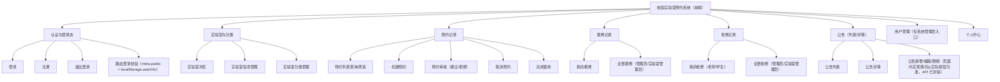
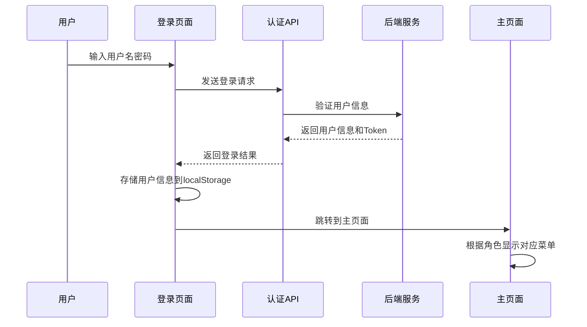
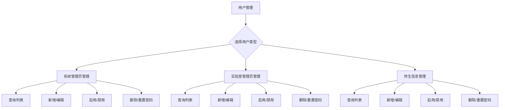
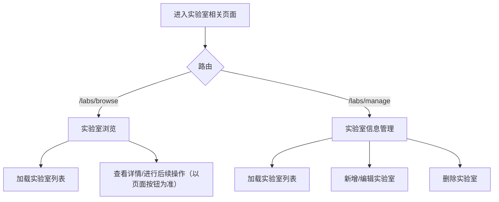
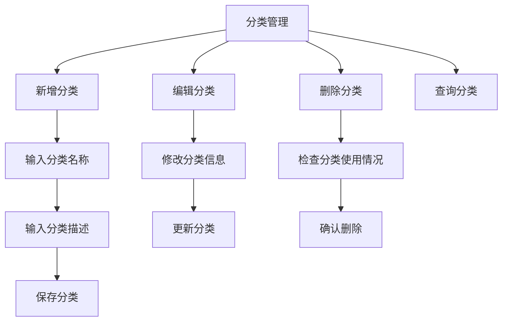

# 校园实验室预约系统设计文档（贴合当前实现）

## 1. 系统概述

### 1.1 项目范围（当前仓库实际）

- 本仓库为**前端单页应用（SPA）**，基于 Vue 3 + Element Plus。
- 系统通过 `axios` 调用后端接口（默认 `http://localhost:8080`），仓库内**不包含后端与数据库实现**。
- 当前前端已实现的页面/模块以路由为准（见 `src/router/index.js`）：登录/注册、主布局、系统首页、实验室浏览/管理、分类管理、预约记录、报修记录（我的/全部）、检修记录（我的/全部）、公告列表/详情、用户管理（系统管理员）、个人中心。

### 1.2 技术栈（以 `Vue_Lab/package.json` 为准）

- **前端框架**：Vue `^3.5.25`
- **UI 组件库**：Element Plus `^2.8.8`
- **路由**：Vue Router `^4.5.0`
- **HTTP 客户端**：Axios `^1.7.9`
- **构建工具**：Vite `^7.3.1`
- **状态管理**：
  - 依赖中包含 `vuex`（`^4.1.0`），但当前代码以**组件内状态 + localStorage** 为主（未看到实际 store 模块落地）。

## 2. 系统总体设计

### 2.1 前端架构（现状）

- **入口**：`src/main.js` → `src/App.vue`（渲染 `router-view`）
- **布局**：`src/layouts/MainLayout.vue`（侧边菜单 + 头部面包屑 + 内容区）
- **路由**：`src/router/index.js`（嵌套路由 + 全局路由守卫）
- **API 封装**：
  - `src/utils/request.js`：axios 实例、请求/响应拦截器、错误码兼容与 `data` 解包
  - `src/api/*.js`：按业务域封装的 API 函数（auth/user/lab/labCategory/reservation/repair/maintenance/announcement）
- **登录态**：`localStorage`（`token`、`userInfo`、`role`）

### 2.2 系统功能模块图（仅包含已实现模块）



## 3. 角色与权限（以当前前端实现为准）

### 3.1 角色来源

- 角色从 `localStorage.role` 或 `localStorage.userInfo.role` 读取，常见值：`系统管理员`、`实验室管理员`、`老师`、`学生`。

### 3.2 当前前端已实现的访问限制

- **登录校验**：除 `/login`、`/register` 外，访问任意路由都要求本地存在 `userInfo`，否则跳转 `/login`。
- **公告路由限制**：当 `role` 为 `老师` 或 `学生` 时，访问任何以 `/announcements` 开头的路径会被重定向到 `/`。
- **菜单入口限制（MainLayout）**：
  - 公告信息、实验室分类、用户管理菜单入口仅对 `系统管理员` 显示。
  - 报修/检修菜单：老师/学生进入“我的”，管理员/实验室管理员进入“全部”。

> 说明：以上为前端侧的入口/路由限制；真正的权限校验以**后端接口鉴权**为准。

## 4. 详细功能模块设计（贴合当前路由与 API）

### 4.1 认证与登录态模块

#### 4.1.1 功能描述（当前已实现）

- 登录：`/login` 调用 `POST /lab/auth/login`，成功后将 `token`、`userInfo`、`role` 写入 `localStorage`
- 注册：`/register` 调用 `POST /lab/auth/register`
- 退出登录：主布局中调用 `POST /lab/auth/logout`（失败也会清理本地登录态），并跳转回 `/login`
- 路由守卫：仅基于 `meta.public` 与本地 `userInfo` 做登录拦截（见 `src/router/index.js`）

#### 4.1.2 流程图



#### 4.1.3 关键文件
- `src/views/Login.vue` - 登录页面
- `src/views/Register.vue` - 注册页面
- `src/api/auth.js` - 认证API
- `src/router/index.js` - 路由守卫

### 4.2 用户管理模块

#### 4.2.1 功能描述（当前已实现/以页面功能为准）

- 用户列表：系统管理员通过菜单进入用户管理，并在同一页面切换不同类型（系统管理员/实验室管理员/师生信息）。
- 常见操作（对应 `src/api/user.js` 已封装接口）：查询列表、创建、编辑、删除、启用/禁用、重置密码。

> 说明：文档不描述“批量导入、操作日志审计”等内容（当前前端未体现相关页面/流程）。

#### 4.2.2 流程图



#### 4.2.3 关键文件
- `src/views/user/UserManage.vue` - 用户管理页面
- `src/api/user.js` - 用户API

### 4.3 实验室管理模块

#### 4.3.1 功能描述（当前已实现）

- 实验室浏览：`/labs/browse` 展示实验室信息并支持进一步操作（以页面实际按钮为准）。
- 实验室管理：`/labs/manage` 对实验室信息进行增删改查（对应 `src/api/lab.js`）。

> 说明：文档不描述“实时状态监控、开放时间规则配置、使用统计”等未在当前前端明确体现的能力。

#### 4.3.2 流程图



#### 4.3.3 关键文件
- `src/views/lab/LabManage.vue` - 实验室管理页面
- `src/views/lab/LabBrowse.vue` - 实验室浏览页面
- `src/api/lab.js` - 实验室API

### 4.4 预约管理模块

#### 4.4.1 功能描述（当前已实现/以页面为准）

- 预约记录页面：`/reservations`（`src/views/reservation/Reservations.vue`）
- 对应 API（`src/api/reservation.js`）：列表查询、创建预约、审核、取消、完成使用。

> 说明：文档不描述“自动通知、提醒、评价、统计分析”等未在当前前端明确体现的能力。

#### 4.4.2 流程图

```mermaid
flowchart TD
  R0[进入 /reservations] --> R1[查询预约列表 listReservationsApi(params)]
  R1 --> R2[展示预约记录与状态]
  R2 --> R3{用户操作（以页面按钮为准）}
  R3 -->|创建| R4[createReservationApi(data)]
  R3 -->|审核| R5[auditReservationApi(id, data)]
  R3 -->|取消| R6[cancelReservationApi(id)]
  R3 -->|完成使用| R7[finishReservationApi(id)]
  R4 --> R1
  R5 --> R1
  R6 --> R1
  R7 --> R1
```

#### 4.4.3 关键文件
- `src/views/reservation/Reservations.vue` - 预约管理页面
- `src/api/reservation.js` - 预约API

### 4.5 公告管理模块

#### 4.5.1 功能描述（当前已实现/以路由守卫为准）

- 页面：公告列表 `/announcements`、公告详情 `/announcements/:id`
- API（`src/api/announcement.js`）：列表、详情、新增、更新、删除（请求会从 `localStorage.userInfo` 读取 `userId` 并附加到 params/body）
- 前端访问限制：当 `role` 为 `老师/学生` 时，访问任何 `/announcements*` 路径会被路由守卫重定向到 `/`

> 说明：文档不描述“富文本、草稿、置顶、通知、已读/未读、公告统计”等未在当前前端明确体现的能力。

#### 4.5.2 流程图

```mermaid
flowchart TD
  A[访问公告相关路由] --> B{路由}
  B -->|/announcements| C[公告列表]
  B -->|/announcements/:id| D[公告详情]

  C --> C1[listAnnouncementsApi(params)]
  C1 --> C2[展示列表]
  C2 --> C3{可选操作（以页面按钮为准）}
  C3 -->|新增| C4[createAnnouncementApi(data)]
  C3 -->|编辑| C5[updateAnnouncementApi(id, data)]
  C3 -->|删除| C6[deleteAnnouncementApi(id)]

  D --> D1[getAnnouncementApi(id)]
  D1 --> D2[展示详情]
```

#### 4.5.3 关键文件
- `src/views/announcement/AnnouncementList.vue` - 公告列表页面
- `src/views/announcement/AnnouncementDetail.vue` - 公告详情页面
- `src/api/announcement.js` - 公告API

### 4.6 报修管理模块

#### 4.6.1 功能描述（当前已实现）

- 页面：
  - 老师/学生：`/repairs/my`（我的报修）
  - 管理员/实验室管理员：`/repairs/all`（全部报修）
- API（`src/api/repair.js`）：报修列表/详情/创建（以 API 文件为准）

> 说明：文档不描述“通知、上传视频、评价、统计分析”等未在当前前端明确体现的能力。

#### 4.6.2 流程图

```mermaid
flowchart TD
  A[进入报修记录页面] --> B{路由}
  B -->|/repairs/my| C[我的报修]
  B -->|/repairs/all| D[全部报修]

  C --> C1[listRepairsApi(params)]
  C1 --> C2[展示列表/详情（以页面为准）]

  D --> D1[listRepairsApi(params)]
  D1 --> D2[展示列表/详情（以页面为准）]
```

#### 4.6.3 关键文件
- `src/views/repair/RepairRecords.vue` - 报修记录页面
- `src/views/repair/MyRepairs.vue` - 我的报修页面
- `src/api/repair.js` - 报修API

### 4.7 检修管理模块

#### 4.7.1 功能描述（当前已实现）

- 页面：
  - 管理员/实验室管理员：`/inspections`（检修记录）
  - 老师/学生：`/inspections/my`（同一页面组件，路由 meta `isMyRecords: true`）
- API（`src/api/maintenance.js`）：检修列表/详情/创建/更新（以 API 文件为准）

> 说明：文档不描述“检修计划、任务分配、报告生成、费用统计”等未在当前前端明确体现的能力。

#### 4.7.2 流程图

```mermaid
flowchart TD
  A[进入检修记录页面] --> B{路由}
  B -->|/inspections| C[检修记录（全部）]
  B -->|/inspections/my| D[检修记录（我的）]

  C --> C1[listMaintenancesApi(params)]
  C1 --> C2[展示列表]
  C2 --> C3{可选操作（以页面按钮为准）}
  C3 -->|新增| C4[createMaintenanceApi(data)]
  C3 -->|编辑| C5[updateMaintenanceApi(id, data)]

  D --> D1[listMaintenancesApi(params + isMyRecords)]
  D1 --> D2[展示列表]
```

#### 4.7.3 关键文件
- `src/views/inspection/InspectionRecords.vue` - 检修记录页面
- `src/api/maintenance.js` - 检修API

### 4.8 分类管理模块

#### 4.8.1 功能描述（当前已实现）

- 页面：`/lab-categories`（系统管理员菜单入口可见）
- API（`src/api/labCategory.js`）：分类列表/创建/更新/删除，以及指定分类管理员等操作（以 API 文件为准）

#### 4.8.2 流程图



#### 4.8.3 关键文件
- `src/views/labCategory/LabCategoryManage.vue` - 分类管理页面
- `src/api/labCategory.js` - 分类API

## 5. 接口设计（与 `src/api/*.js` 对齐）

### 5.1 认证接口
- `POST /lab/auth/login` - 用户登录
- `POST /lab/auth/register` - 用户注册
- `POST /lab/auth/logout` - 用户退出

### 5.2 用户管理接口
- `GET /lab/users` - 获取用户列表
- `POST /lab/users` - 创建用户
- `PUT /lab/users/{id}` - 更新用户
- `DELETE /lab/users/{id}` - 删除用户

### 5.3 实验室管理接口
- `GET /lab/labs` - 获取实验室列表
- `POST /lab/labs` - 创建实验室
- `PUT /lab/labs/{id}` - 更新实验室
- `DELETE /lab/labs/{id}` - 删除实验室

### 5.4 预约管理接口
- `GET /lab/reservations` - 获取预约列表
- `POST /lab/reservations` - 创建预约
- `PUT /lab/reservations/{id}/audit` - 审核预约
- `PUT /lab/reservations/{id}/cancel` - 取消预约
- `PUT /lab/reservations/{id}/finish` - 完成使用

## 6. 安全与权限说明（前端侧现状）

- 请求封装会在请求头中附带 `Authorization: Bearer <token>`（当本地有 `token` 时）。
- 还会附带 `X-User-Id`，以及当角色为 `系统管理员` 时附带 `X-Role: Admin`（避免中文 header）。
- 前端路由守卫用于拦截未登录访问，以及限制老师/学生访问公告路由；接口级别的最终鉴权应由后端实现。

## 7. 部署说明（前端）

### 7.1 环境要求
- Node.js 16+
- 现代浏览器支持
- 后端API服务

### 7.2 构建部署
```bash
# 安装依赖
npm install

# 开发环境
npm run dev

# 生产构建
npm run build

# 预览构建结果
npm run preview
```

---

**文档版本**：v1.1  
**创建日期**：2026年3月11日  
**最后更新**：2026年3月11日
