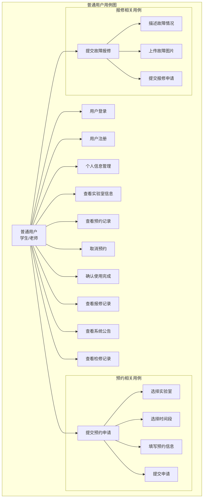
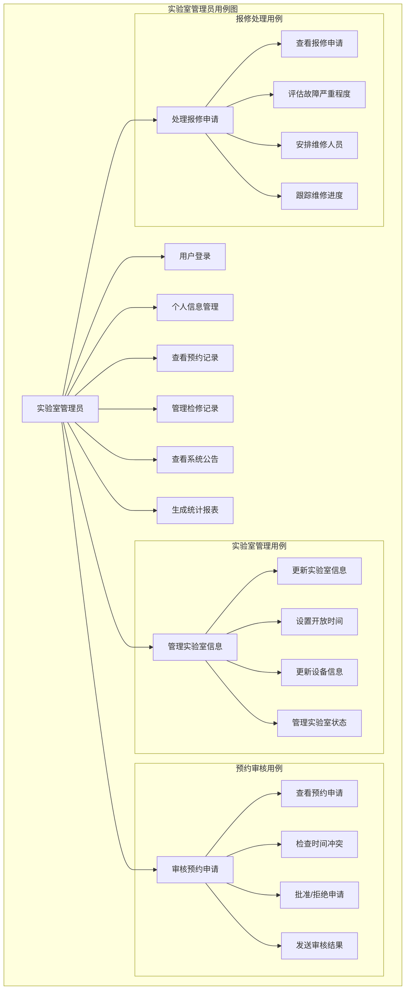
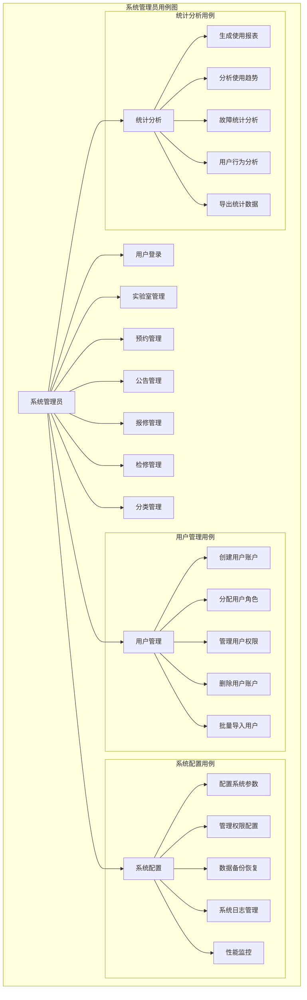

# 校园实验室预约系统需求分析

## 3 系统需求分析

### 3.1 系统总体需求分析

#### 3.1.1 项目背景
随着高校实验室资源的不断增加和教学科研需求的日益增长，传统的实验室管理方式已无法满足现代化管理的需求。手工登记、电话预约等方式效率低下，信息不透明，资源利用率不高。因此，开发一套基于Web的实验室预约管理系统，实现实验室资源的数字化、智能化管理，具有重要的现实意义。

#### 3.1.2 系统目标
1. **提高管理效率**：通过信息化手段简化实验室管理流程，减少人工操作
2. **优化资源配置**：实现实验室资源的合理分配和高效利用
3. **提升用户体验**：为师生提供便捷的预约服务，改善使用体验
4. **增强数据透明度**：实时展示实验室使用状态，避免资源冲突
5. **支持决策分析**：通过数据统计为管理决策提供依据

#### 3.1.3 系统范围
系统主要涵盖以下业务范围：
- 实验室基本信息管理
- 实验室预约流程管理
- 用户权限与角色管理
- 设备报修与维护管理
- 系统公告与信息发布
- 数据统计与分析

### 3.2 系统功能分析

#### 3.2.1 系统功能结构图

```mermaid
graph TB
    A[校园实验室预约系统] --> B[用户管理模块]
    A --> C[实验室管理模块]
    A --> D[预约管理模块]
    A --> E[公告管理模块]
    A --> F[报修管理模块]
    A --> G[检修管理模块]
    A --> H[统计分析模块]
    A --> I[系统管理模块]
    
    B --> B1[用户注册]
    B --> B2[用户登录]
    B --> B3[权限管理]
    B --> B4[个人信息管理]
    
    C --> C1[实验室信息维护]
    C --> C2[实验室状态监控]
    C --> C3[实验室分类管理]
    C --> C4[开放时间设置]
    
    D --> D1[预约申请]
    D --> D2[预约审核]
    D --> D3[预约查询]
    D --> D4[使用确认]
    D --> D5[预约取消]
    
    E --> E1[公告发布]
    E --> E2[公告编辑]
    E --> E3[公告查询]
    E --> E4[公告删除]
    
    F --> F1[故障报修]
    F --> F2[报修处理]
    F --> F3[维修记录]
    F --> F4[维修状态跟踪]
    
    G --> G1[检修计划]
    G --> G2[检修记录]
    G --> G3[检修报告]
    G --> G4[设备状态更新]
    
    H --> H1[预约统计]
    H --> H2[使用率分析]
    H --> H3[故障统计]
    H --> H4[用户活跃度分析]
    
    I --> I1[系统配置]
    I --> I2[数据备份]
    I --> I3[日志管理]
    I --> I4[权限配置]
```

#### 3.2.2 核心功能描述

**用户管理功能**
- 支持多角色用户注册和登录
- 基于角色的权限控制
- 用户信息维护和查询
- 个人资料管理

**实验室管理功能**
- 实验室基本信息的增删改查
- 实验室分类管理
- 实验室状态实时监控
- 开放时间设置

**预约管理功能**
- 在线预约申请
- 预约审核流程
- 预约记录查询
- 使用状态确认
- 预约取消处理

**公告管理功能**
- 系统公告发布
- 公告编辑和删除
- 公告分类管理
- 公告推送通知

### 3.3 系统用例分析

#### 3.3.1 普通用户（学生、老师）用例图

#### 3.3.2 实验室管理员用例图

#### 3.3.3 系统管理员用例图

#### 3.3.4 用例详细描述

**普通用户核心用例**

| 用例名称 | 用例描述 | 参与者 | 前置条件 | 后置条件 |
|----------|----------|--------|----------|----------|
| 提交预约申请 | 用户选择实验室和时间段，提交预约申请 | 学生/老师 | 已登录系统 | 生成待审核预约记录 |
| 取消预约 | 用户取消自己提交的预约申请 | 学生/老师 | 预约状态为待审核 | 预约状态更新为已取消 |
| 确认使用完成 | 用户确认实验室使用完成 | 学生/老师 | 预约状态为使用中 | 预约状态更新为已完成 |
| 提交故障报修 | 用户报告实验室设备故障 | 学生/老师 | 已登录系统 | 生成待处理报修记录 |

**实验室管理员核心用例**

| 用例名称 | 用例描述 | 参与者 | 前置条件 | 后置条件 |
|----------|----------|--------|----------|----------|
| 审核预约申请 | 管理员审核用户提交的预约申请 | 实验室管理员 | 存在待审核预约 | 预约状态更新为已审核 |
| 处理报修申请 | 管理员处理用户提交的报修申请 | 实验室管理员 | 存在待处理报修 | 报修状态更新为处理中 |
| 管理实验室信息 | 更新负责实验室的基本信息 | 实验室管理员 | 已分配管理权限 | 实验室信息更新 |

**系统管理员核心用例**

| 用例名称 | 用例描述 | 参与者 | 前置条件 | 后置条件 |
|----------|----------|--------|----------|----------|
| 用户管理 | 创建、修改、删除系统用户 | 系统管理员 | 已登录系统 | 用户信息更新 |
| 系统配置 | 配置系统运行参数 | 系统管理员 | 已登录系统 | 系统参数更新 |
| 数据备份 | 备份系统重要数据 | 系统管理员 | 已登录系统 | 生成备份文件 |

### 3.4 可行性分析

#### 3.4.1 技术可行性

**前端技术可行性**
- Vue 3框架成熟稳定，社区活跃，文档完善
- Element Plus组件库提供丰富的UI组件，开发效率高
- Vite构建工具支持快速开发和热更新
- 现代浏览器对Web标准支持良好

**后端技术可行性**
- RESTful API设计规范成熟，易于实现和维护
- JSON数据格式通用，解析简单
- HTTP协议稳定可靠，安全性有保障

**开发工具可行性**
- 开发环境配置简单，学习成本较低
- 调试工具完善，问题定位容易
- 版本控制工具支持团队协作

#### 3.4.2 经济可行性

**开发成本分析**
- 前端开发：基于开源框架，无授权费用
- 开发工具：免费使用，降低开发成本
- 人力资源：2-3名前端开发人员，开发周期2-3个月

**运营成本分析**
- 服务器成本：云服务器租赁费用可控
- 维护成本：系统架构简单，维护工作量小
- 升级成本：模块化设计，便于功能扩展

**经济效益分析**
- 提高实验室利用率，减少资源浪费
- 降低管理成本，提高工作效率
- 提升用户满意度，改善服务质量
- 为管理决策提供数据支持，优化资源配置

#### 3.4.3 操作可行性

**用户操作可行性**
- 界面设计简洁直观，符合用户使用习惯
- 操作流程清晰，降低学习成本
- 提供操作提示和帮助文档
- 支持多种设备访问，使用便捷

**管理操作可行性**
- 管理功能集中，操作效率高
- 数据可视化展示，便于理解
- 批量操作支持，减少重复工作
- 权限控制严格，确保数据安全

**技术维护可行性**
- 代码结构清晰，便于维护
- 模块化设计，便于功能扩展
- 日志记录完善，便于问题排查
- 文档齐全，便于知识传承

### 3.5 非功能性需求

#### 3.5.1 性能需求
- 页面加载时间：不超过3秒
- 系统响应时间：普通操作不超过1秒
- 并发用户数：支持100+用户同时在线
- 数据处理能力：支持10000+记录查询

#### 3.5.2 安全需求
- 用户身份认证：支持用户名密码登录
- 权限控制：基于角色的访问控制
- 数据加密：敏感数据传输加密
- 操作日志：记录关键操作行为

#### 3.5.3 可用性需求
- 系统可用性：99%以上
- 界面友好性：操作简单直观
- 错误处理：提供清晰的错误提示
- 帮助文档：提供完整的操作指南

#### 3.5.4 兼容性需求
- 浏览器兼容：支持Chrome、Firefox、Safari、Edge
- 设备兼容：支持PC、平板、手机访问
- 分辨率适配：支持1920x1080到1366x768分辨率
- 操作系统：支持Windows、macOS、Linux

---

**文档版本**: v1.0  
**创建日期**: 2026年3月11日  
**最后更新**: 2026年3月11日
